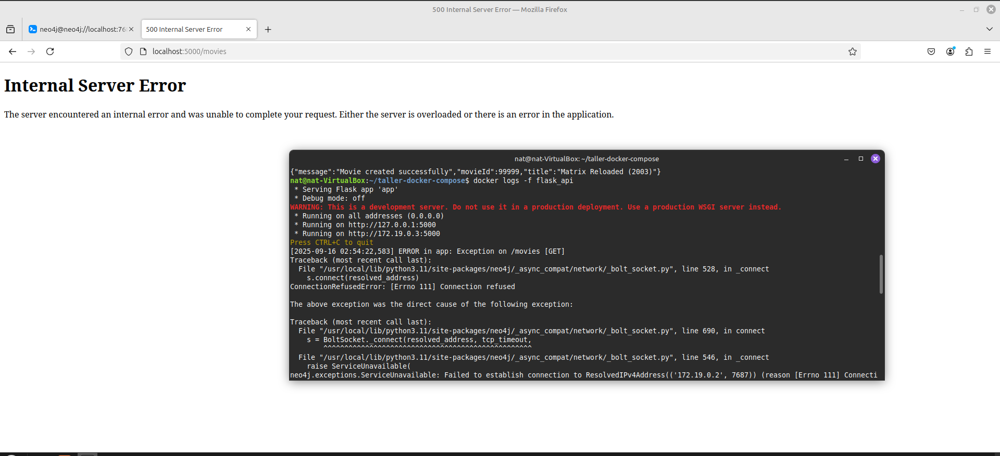

# taller-distribuidos-docker-compose

## Punto 1

Endpoint POST antes del cambio:

Endpoint POST luego del cambio del punto 2, saca error pues no existe conexión con la base de datos por el servidor:

## Punto 2

### Parte a

Se evidencia en el archivo docker-compose.yml

### Parte b

Aqui se evidencia el error y log de la aplicación

## ¿Qué red es más práctica para proyectos distribuidos? ¿Por qué?

La red user-defined bridge es más práctica porque permite usar nombres de servicio en lugar de IP, por lo cual facilita la configuración del entorno de desarrollo.

# Conclusión

La red bridge es la que se pone por defecto pero al no configurar nombres de servicio la configuración depende de las direcciones IP, por esto, usar una red user-defined es más sencillo, en este caso la API pudo conectarse a la base de datos simplemente usando el nombre del servicio.
